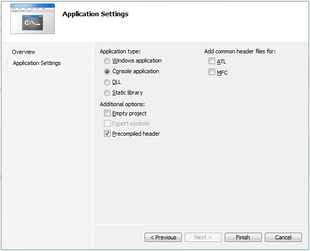
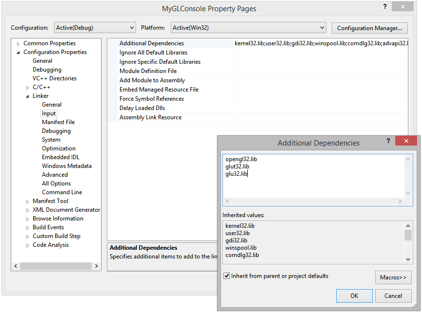

I was recently helping a friend get set up running OpenGL and I realized that most of the instructions available online for this are fairly outdated. So, here’s a quick run through to set the record straight. This guide is meant for beginners who just want to get a simple OpenGL desktop app going on a Windows machine.

This guide assume you have the following installed:

1. Windows 7 or newer
2. Visual Studio 2008 or newer

By convention, we assume the OS is installed to the C drive and VS is installed to a folder such as `C:\Program Files (x86)\Microsoft Visual Studio 10.0`. VS 2008 maps to 9.0, VS 2010 to 10.0, and VS 2012 to 11.0.

## Installing GLUT

The first step is to download GLUT (the [OpenGl Utility Toolkit](https://en.wikipedia.org/wiki/OpenGL_Utility_Toolkit)). This library provides a slew of helper functions for working with OpenGL, including setting up a window. Grab the latest binaries from [here](https://user.xmission.com/~nate/glut.html). Unzip this and copy the binaries out into the following directories. Be aware that these are 32-bit binaries. You will need to create the `gl` folder in `Microsoft Visual Studio 10.0\VC\include\`, as it doesn’t already exist.

<div>
<table>
<tbody>
<tr><th></th><th>File</th><th>Destination Folder</th></tr>
<tr><th rowspan="3">Windows 64-bit</th><td>glut32.dll</td><td>C:\Windows\SysWOW64\</td></tr>
<tr><td>glut.h</td><td>C:\Program Files (x86)\Microsoft Visual Studio 10.0\VC\include\gl\</td></tr>
<tr><td>glut32.lib</td><td>C:\Program Files (x86)\Microsoft Visual Studio 10.0\VC\lib\</td></tr>
<tr><th rowspan="3">Windows 34-bit</th><td>glut32.dll</td><td>C:\Windows\System32\</td></tr>
<tr><td>glut.h</td><td>C:\Program Files\Microsoft Visual Studio 10.0\VC\include\gl\</td></tr>
<tr><td>glut32.lib</td><td>C:\Program Files\Microsoft Visual Studio 10.0\VC\lib\</td></tr>
</tbody>
</table>
</div>

## Creating the VS project

Now boot up Visual Studio. You’ll want to create a simple Win32 console application. In VS 2010, open the New Project dialog and look at the list of templates. Select “Visual C++\Win32\Win32 Console Application”. Click through the Wizard that appears, leaving the defaults in place.



## Linking the libraries

At this point you should get a solution with a couple of default files and a `_tmain` entry function. Right-click the project you created, go to Properties, then open Configuration Properties\Linker\Input and add the following to the “Additional Dependencies” field: `opengl32.lib;glut32.lib;glu32.lib`.



## Writing the code

Modify your main .cpp file to look like this:

```cpp
#include "stdafx.h"
#include <gl/glut.h>

// One-time initializtion logic
void init( void )
{
    printf( "OpenGL version: %s\n", (char*)glGetString(GL_VERSION));
    printf( "OpenGL renderer: %s\n", (char*)glGetString(GL_RENDERER));

    //Configure basic OpenGL settings
    glClearColor(0.0, 0.0, 0.0, 1.0);
    glShadeModel(GL_SMOOTH);
    glEnable(GL_BLEND);
    glEnable(GL_TEXTURE_2D);
}

// Main drawing routine. Called repeatedly by GLUT's main loop
void display( void )
{
    //Clear the screen and set our initial view matrix
    glClear(GL_COLOR_BUFFER_BIT | GL_DEPTH_BUFFER_BIT | GL_STENCIL_BUFFER_BIT);
    glMatrixMode(GL_MODELVIEW);
    glLoadIdentity();

    //TODO: Perform drawing here

    //We just drew to the back buffer. Now we need to swap that with the
    //front buffer to show it on screen.
    glutSwapBuffers();
}

// Entry point - GLUT setup and initialization
int main( int argc, char** argv )
{

   glutInit( &argc, argv );
   glutInitDisplayMode (GLUT_DEPTH | GLUT_DOUBLE | GLUT_RGB);
   glutInitWindowSize (800, 600);
   glutInitWindowPosition (100, 100);
   glutCreateWindow( "OpenGL Test" );
   glutDisplayFunc( display );

   init();

   glutMainLoop();

   return 0;
}
```

Hit F5 to build and run. You should get a window with a black screen. Pat yourself on the back. You’re now ready to start coding with OpenGL.
